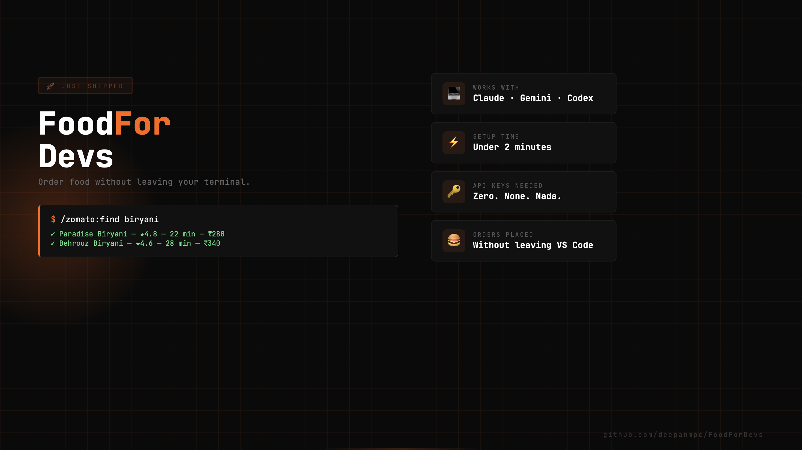
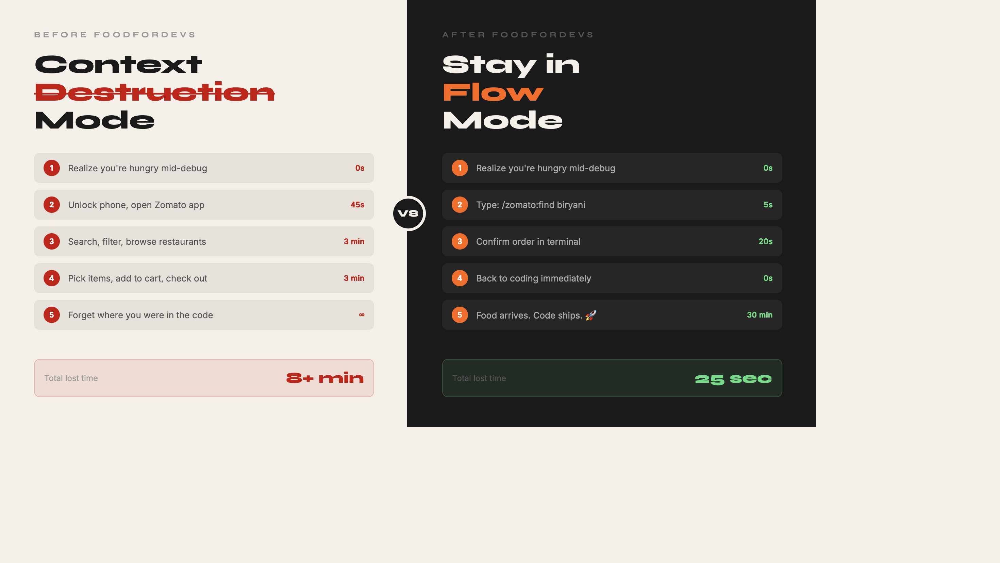
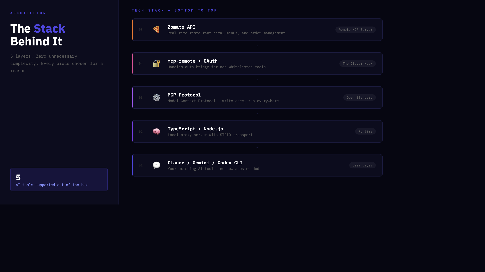
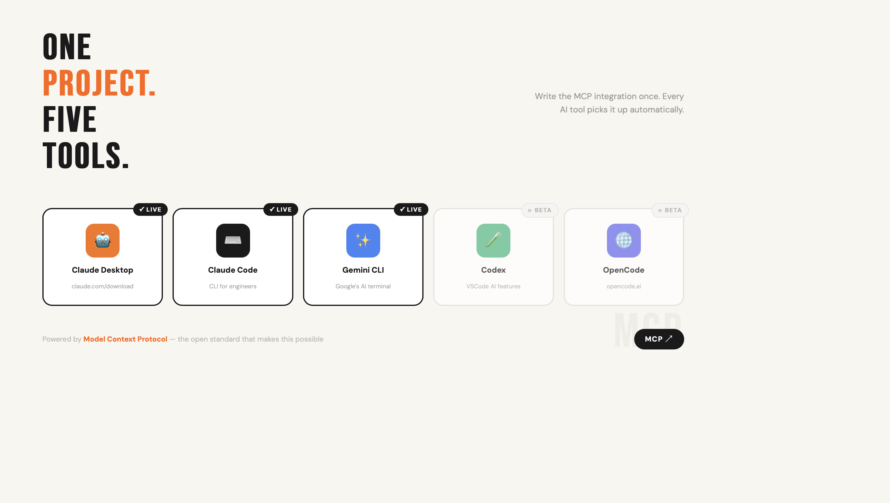

# FoodForDevs 🍔

[](https://github.com/deepanmpc/FoodForDevs)
[](https://opensource.org/licenses/MIT)

**"The best code is written after lunch."**

FoodForDevs is the first terminal-native, personalised food ordering bridge. Stop losing your flow state to phone apps—order your favorite meals directly from your IDE in under 30 seconds.



---

## 🧠 The Problem: Context Destruction
Flow state is a developer's superpower. Every time you switch to your phone to browse Zomato, you don't just lose 8 minutes—you lose your momentum.

**Food ordering lacks true personalization and seamless integration into daily workflows.**



---

## 🛠️ The Solution
We built a bridge between Zomato's ecosystem and your favorite AI CLIs using the **Model Context Protocol (MCP)**. Your AI assistant now understands your taste, remembers your preferences, and handles the logistics.



### One Project. Five Tools.
Write the integration once, use it everywhere. FoodForDevs works out of the box with:
- **Claude Desktop** (Stable)
- **Claude Code CLI** (Stable)
- **Gemini CLI** (Stable)
- **Codex** (Beta)
- **OpenCode** (Beta)



---

## ⚡ Quick Start (2-Min Setup)

No API keys. No subscriptions. No friction.

### 1. Install Zomato MCP
Run this command to add the server to your Claude configuration:

```bash
cat > ~/Library/Application\ Support/Claude/claude_desktop_config.json << 'EOF'
{
  "mcpServers": {
    "zomato-mcp": {
      "command": "npx",
      "args": [
        "-y",
        "mcp-remote",
        "https://mcp-server.zomato.com/mcp"
      ]
    }
  }
}
EOF
```

### 2. Sign In
Type `find pizza restaurants` in any supported tool. A browser will open—login with your Zomato phone number once.

### 3. Start Ordering
```bash
/zomato:find biryani
/zomato:menu [restaurant_id]
/zomato:order [dish_name]
```

---

## 🔮 Agentic Magic
Set your preferences once and let the agent handle the rest.

> "Tonight I want something for dinner"

The agent will automatically:
1. **Search Smart** based on your chicken/veg/spice preferences.
2. **Recommend** from your favorite spots like Paradise or Behrouz.
3. **Budget** within your ₹500-800 range.
4. **Track** the delivery for you.

---

## 🤝 Contribute
We are building the future of agentic commerce. If you love the idea of seamless, AI-driven ordering, we'd love your help!

1. ⭐ **Star** this repo to show your support.
2. 🍴 **Fork** and submit a PR for new features.
3. 💬 **Suggest** new integrations in the Issues.

Built with ❤️ by [Deepan](https://github.com/deepanmpc)
